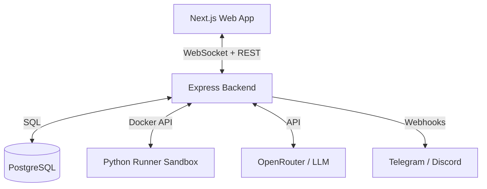

# 🚀 CollabCode AI

> **Инновационная экосистема для совместной разработки, обучения и ИИ-наставничества.**

---

[](https://github.com/)
[](https://github.com/)

**CollabCode AI** — это не просто редактор кода. Это полноценная платформа для командных сессий, хакатонов и образовательных воркшопов, объединяющая в себе мощь совместного редактирования в реальном времени, безопасного изолированного исполнения кода и помощи искусственного интеллекта.

---

## ✨ Ключевые возможности

| Функция | Описание |
| :--- | :--- |
| 🛡️ **Изолированный Runtime** | Запуск Python-кода в отдельных Docker-контейнерах с ограничениями по ресурсам и времени. |
| 🤖 **AI Наставник** | Интеграция с OpenAI/OpenRouter для проведения ревью кода и помощи в решении задач в реальном времени. |
| 👥 **Коллаборация 2.0** | Синхронизация текста (Yjs) без конфликтов, отображение удаленных курсоров и лента событий. |
| 📊 **Dashboard жюри** | Реалтайм-метрики по каждой комнате: активность, качество кода и геймификация. |
| 📢 **Омниканальность** | Интеграция с Telegram и Discord для мгновенных уведомлений о запуске кода или достижениях. |

---

## 🛠 Технологический стек

Проект построен по принципу монорепозитория для максимальной эффективности разработки:

- **Frontend**: `Next.js 15 (App Router)`, `React 19`, `Monaco Editor`, `Framer Motion`, `Tailwind CSS`.
- **Backend**: `Node.js`, `Express`, `TypeScript`.
- **Real-time**: `WebSockets (ws)`, `Yjs (CRDT)`.
- **Data**: `PostgreSQL`, `Drizzle ORM` (подготовлено).
- **Security**: `Docker Sandbox` (изоляция процессов), `JWT Auth`.
- **AI**: `OpenRouter API` (универсальный доступ к топовым LLM).

---

## 🔐 Безопасность и Изоляция

Мы серьезно относимся к безопасности исполнения пользовательского кода:
1. **Docker Sandbox**: Каждый запуск кода происходит в изолированном контейнере с ограниченными правами.
2. **Resource Quotas**: Ограничения по памяти (512MB) и CPU (0.5 ядра) предотвращают атаки типа DoS.
3. **Network Isolation**: Контейнеры по умолчанию не имеют доступа к внутренней сети проекта.
4. **Auto-Cleanup**: Все временные артефакты и контейнеры удаляются сразу после завершения или по таймауту неактивности.

---

## 🏗 Архитектура системы



---

## 📂 Структура и Глубина проекта

Для удобства жюри мы подготовили подробные материалы по внутреннему устройству:
- 📖 **[Структура папок и файлов](docs/PROJECT_STRUCTURE_RU.md)** — где искать код.
- 🧠 **[Обоснование технических решений](docs/DECISION_LOG_RU.md)** — почему мы выбрали именно этот стек.
- 📋 **[Техническое задание (ТЗ)](docs/TECHNICAL_SPEC_RU.md)** — исходные требования и область реализации.

---

## 🚀 Быстрый старт (Simple Start)

Весь проект настроен для запуска одной командой через Docker Compose.

### 1. Подготовка
Создайте файл `.env` из примера:
```bash
cp .env.example .env
```
*Укажите в нем ваш `OPENROUTER_API_KEY` и `TELEGRAM_BOT_TOKEN`, если хотите протестировать ИИ и уведомления.*

### 2. Запуск
```bash
docker-compose up --build -d
```

Система будет доступна по адресам:
- **Frontend**: `http://localhost:3000`
- **API Server**: `http://localhost:4000`
- **Demo Room**: `http://localhost:3000/room/demo-room`

---

## ✅ Что реализовано (MVP Readiness)

Мы сфокусировались на ключевых функциях, которые работают уже сейчас:

- **Совместная работа**: Редактирование кода в реальном времени с отображением курсоров и выделений других участников.
- **Безопасный запуск**: Выполнение Python-скриптов в изолированных Docker-контейнерах с лимитами ресурсов.
- **Умный помощник**: Использование мощных LLM (Arcee-AI) через OpenRouter для ревью кода прямо в редакторе.
- **Уведомления**: Мгновенная рассылка в Telegram и Discord о важных событиях в комнате.
- **Управление доступом**: Полноценная ролевая модель (Владелец, Редактор, Зритель) и закрытые комнаты по паролю.
- **Аналитика**: Панель мониторинга активности участников и качества кода в реальном времени.

---

Разработано специально для Хакатона 2026. 🤘
